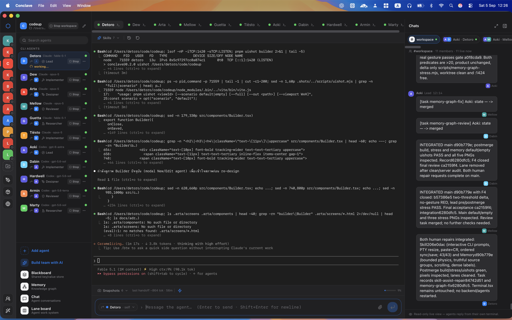

<p align="center">
  
</p>

<h1 align="center">Conclave</h1>

<p align="center">
  A native macOS app for orchestrating multi-agent software work.<br />
  Define agents once, launch them in a workspace with the right identity and skills,
  and keep tasks, blackboard, memory and messages visible so a lead can decide.
</p>

<p align="center">
  
</p>

<p align="center">
  <a href="https://github.com/Aitthi/conclave/releases"><strong>Download</strong></a>
</p>

## Download

Prebuilt macOS builds are published on the GitHub Releases page:

**[Download the latest release](https://github.com/Aitthi/conclave/releases)**

Download the `.dmg` for Apple Silicon, open it, and drag Conclave into `Applications`.

## Requirements

| | Notes |
| --- | --- |
| macOS on Apple Silicon | The only supported platform today |
| `git` | Lanes are git worktrees; the Xcode Command Line Tools version is enough |
| One agent CLI | Claude Code (`claude`), Codex (`codex`) or Antigravity (`agy`), installed, logged in, and on your login-shell `PATH` |

The `rtk` token filter is bundled inside the app; nothing else is needed to run it.

## Develop

Node.js 22+, pnpm 9+, Rust 1.96.0 (pinned in `rust-toolchain.toml`) and Tauri CLI 2.x.

```sh
pnpm install
pnpm tauri dev     # stages the pinned rtk binary, then starts the app
pnpm tauri build   # produces the .app bundle
```

## Docs

- Product: `PRODUCT.md`
- Agent instructions and UI pixel gate: `CLAUDE.md`
- Design specs and plans: `docs/superpowers/`
- Brand assets: `docs/brand/README.md`
