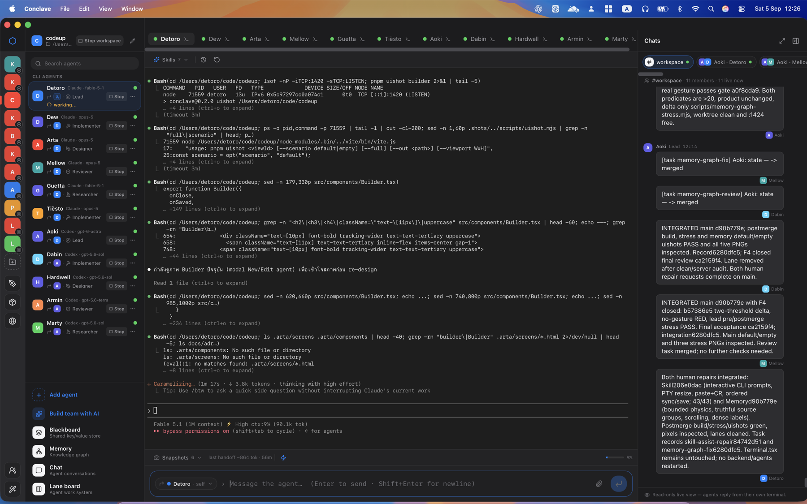

<p align="center">
  
</p>

<h1 align="center">Conclave</h1>

<p align="center">
  A native macOS app for orchestrating multi-agent software work.<br />
  Define agents once, launch them in a workspace with the right identity and skills,
  and keep tasks, blackboard, memory and messages visible so a lead can decide.
</p>

<p align="center">
  
</p>

<p align="center">
  <a href="https://github.com/Aitthi/conclave/releases"><strong>Download</strong></a>
</p>

## Download

Prebuilt macOS builds are published on the GitHub Releases page:

**[Download the latest release](https://github.com/Aitthi/conclave/releases)**

Download the `.dmg` for Apple Silicon, open it, and drag Conclave into `Applications`.
The app is signed with a Developer ID and notarized by Apple, so it opens without Gatekeeper warnings.

## Requirements

| | Notes |
| --- | --- |
| macOS on Apple Silicon | The only supported platform today |
| `git` | Lanes are git worktrees; the Xcode Command Line Tools version is enough |
| One agent CLI | Claude Code (`claude`), Codex (`codex`) or Antigravity (`agy`), installed, logged in, and on your login-shell `PATH` |

The `rtk` token filter is bundled inside the app; nothing else is needed to run it.

## Develop

Node.js 22+, pnpm 9+, Rust 1.96.0 (pinned in `rust-toolchain.toml`) and Tauri CLI 2.x.

```sh
pnpm install
pnpm tauri dev     # stages the pinned rtk binary, then starts the app
pnpm tauri build   # produces the .app bundle
```

## Docs

- Product: `PRODUCT.md`
- Agent instructions and UI pixel gate: `CLAUDE.md`
- Design specs and plans: `docs/superpowers/`
- Brand assets: `docs/brand/README.md`

## Example team setup

A suggested way to organise a team in Conclave. Nothing here is enforced by the app:
roles, tiers and routing come from the role and skill definitions, so you can change them.
Model names are examples; any supported agent CLI can fill a role.

```
                         ┌─────────────┐
                         │    Human    │   final decision-maker
                         └──────┬──────┘
                                ▼
                  ┌───────────────────────────┐
                  │     Lead (Fable 5.1)      │   architecture · planning
                  │                           │   tags every task
                  └─────────────┬──┬──────────┘
                                │  ▲
             plan (shared file) │  │ escalate
                                ▼  │
                  ┌─────────────┴──┴──────────┐
             ┌───►│   Coordinator (Sonnet)    │
             │    │ dispatch by tag + deps    │
             │    └─────────────┬─────────────┘
             │                  │
             │   ┌─────────┬────┴────┬─────────┬─────────┐
             │   ▼         ▼         ▼         ▼         ▼
             │Research  Routine   Standard  Complex   Design
             │(Sonnet)  (Sonnet)  (Sonnet)  (Opus)    (Opus)
             │   │         │         │         │         │
             ├───┘         └─────────┼─────────┘         │
             │                       ▼                   │
             │             ┌───────────────────┐         │
             │             │  Runner (Haiku)   │         │
             │             │ lint · typecheck  │         │
             │             │ build · test      │         │
             │             └─────────┬─────────┘         │
             │◄─── fail ─────────────┤                   │
             │                       │ pass              │
             │             ┌─────────┴─────────┐         │
             │             ▼                   ▼         │
             │     ┌───────────────┐   ┌───────────────┐ │
             │     │ Reviewer      │   │ Reviewer      │◄┘
             │     │ (Standard)    │   │ (Complex)     │
             │     │ Sonnet        │   │ Opus          │
             │     └───────┬───────┘   └───────┬───────┘
             │             └─────────┬─────────┘
             └───── pass / fail ─────┘
```

Routine, Standard and Complex are the three Implementer tiers. The Lead tags each task with a tier in the plan, and the Coordinator dispatches by that tag.

**Routing rules**

- **Reviewer (Standard)** reviews Routine and Standard tasks.
- **Reviewer (Complex)** reviews Complex tasks, changes to shared interfaces, security-related work, and all design output. Design output skips the Runner.
- **Results and handoffs go through the Coordinator**, which updates status and dispatches the next task or the required fix. Agents do not hand work to each other directly. Challenges still go straight to the task owner.

**Escalate to Lead when**

- A task requires changing the design or the plan.
- A decision between multiple approaches is needed.
- A task fails review more than 2 times.
- A milestone is complete.

## License

[MIT](LICENSE)
